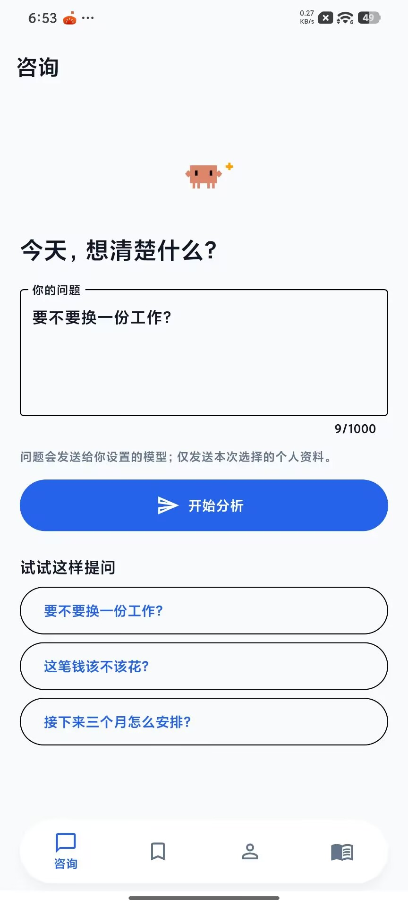
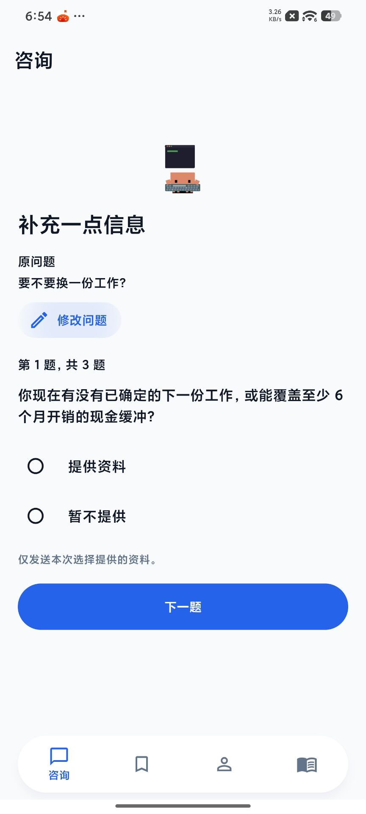
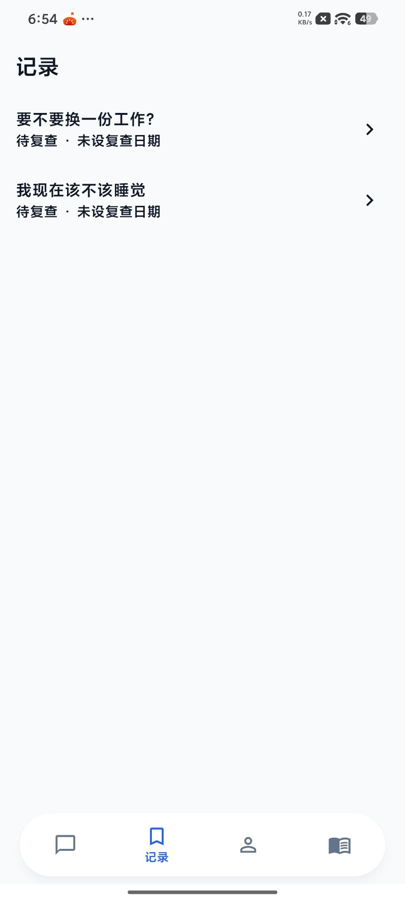
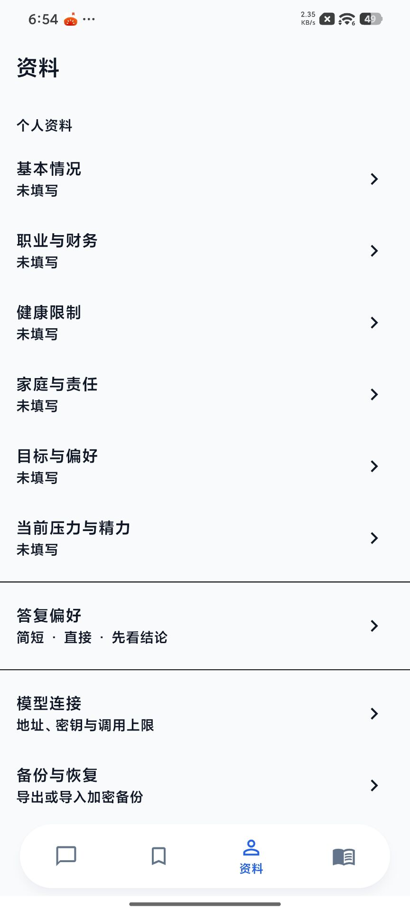
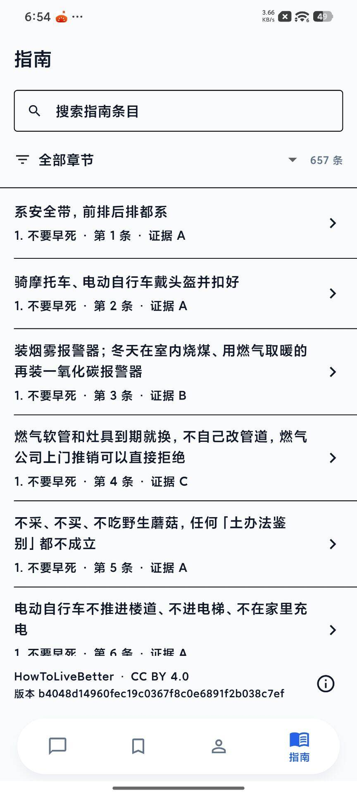

# 个人决策助手

一款面向个人使用的 Android 决策工具：用本地指南、用户主动提供的资料和自有模型连接，把问题整理成可复查的下一步。

<p align="center">
  <a href="#界面预览">界面预览</a> ·
  <a href="#能做什么">能做什么</a> ·
  <a href="#隐私与边界">隐私与边界</a> ·
  <a href="#本地运行">本地运行</a> ·
  <a href="#内置指南与署名">内置指南与署名</a>
</p>

## 界面预览

| 提问 | 补充信息 | 答复与保存 |
| --- | --- | --- |
|  |  |  |

| 决策记录 | 个人资料与设置 | 离线指南 |
| --- | --- | --- |
|  |  |  |

## 能做什么

### 从问题到行动

- 输入自己的问题，或从三个可编辑示例开始。
- 先查看结论和今天的下一步；理由、风险、引用、未知信息和已用资料可按需展开。
- 最多回答三个澄清问题，并自行决定是否提供每一项资料。
- 把答复保存为记录，设置复查日期，并在之后标记继续、修改或结束。

### 风险与指南

- 内置 657 条《HowToLiveBetter》指南，可离线搜索、按章节浏览和查看来源。
- 紧急问题先显示求助行动与 120、110、119 拨号入口。
- 医疗、法律和投资问题会显示风险边界及专业求助方向。
- 可主动检查官方指南更新；更新失败不影响离线阅读。

### 个人资料与模型

- 按需管理六类个人资料和答复偏好。
- 配置、测试或删除 OpenAI 兼容模型连接；可设置每日请求次数和单次答复长度上限。
- 导出或恢复加密备份；恢复后需重新填写模型连接。

## 隐私与边界

- 没有账号、云同步、模型代理、远程分析或广告追踪。
- 指南搜索和阅读在设备本地完成。
- 咨询仅发送本次问题、相关指南，以及用户主动选择的最小必要资料给已配置模型。
- API Key 保存于系统安全存储，页面不回显，也不会包含在备份中。
- 敏感输入会在本地提示删除后再提交。

## 本地运行

需要 Flutter SDK 和 Android SDK。

```sh
flutter pub get
flutter test
flutter analyze
flutter build apk --debug
```

调试 APK 位于 `build/app/outputs/flutter-apk/app-debug.apk`，仅用于测试安装。

Windows 下，Flutter 当前工具链无法在含中文的工程路径稳定构建 Android 调试包。将工程父目录映射到空闲盘符后，在映射盘符中的工程目录运行上述命令即可。完整步骤见 [ANDROID-BUILD-WINDOWS.md](ANDROID-BUILD-WINDOWS.md)。

## 项目结构

```text
lib/       Flutter 应用代码
assets/    内置指南、界面资源与 README 截图
test/      自动化测试
tool/      指南构建脚本
android/   Android 平台工程
```

## 内置指南与署名

`assets/guide.json` 基于 [HowToLiveBetter](https://github.com/eternity4719/HowToLiveBetter) 的固定提交 `b4048d14960fec19c0367f8c0e6891f2b038c7ef` 生成，保留项目署名、版本和许可信息。

指南正文版权归原项目作者所有，按 [CC BY 4.0](https://creativecommons.org/licenses/by/4.0/) 使用。如需重新生成指南包：

```sh
dart run tool/build_guide.dart <HowToLiveBetter 仓库>/book assets/guide.json
```

## 当前状态

自动化测试与静态检查已通过，Android 调试包已构建。真机外观和交互仍建议在目标设备上复核。
